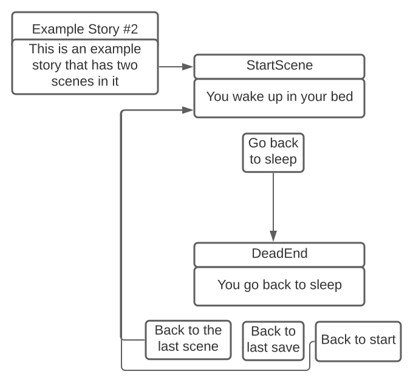

---
| [**BACK TO HOME**](/README.md) | [**BACK TO EXAMPLE STORIES**](/exampleStorys/MAIN.md) |

---

# Example Story #1

**About:** This is a very short story with only two scenes.

**Code:**
```
> Creates a start scene.
start = .CreateStart
> Sets up the start scene with a title, description, and text.
start.addTitle "Example Story #1"
start.addDesc "This is an example story that has two scenes in it"

> Creates a dead-end scene.
end = .CreateDeadEnd
> Sets up the dead-end scene
end.addText "You go back to sleep"

> Creates a new option that is "Go back to sleep".
option1 = .CreateOption "Go back to sleep"
> Links the option to the dead-end scene.
option1.link end
> Adds the option to the start scene.
start.addNextScene end
```

**Graph:**

